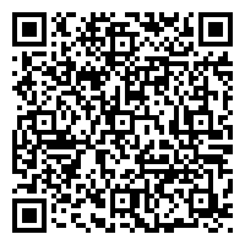

# Pawel Sloboda - Portfolio Website

A modern, accessible, and AI-powered portfolio website built with Astro, React, TypeScript, and Tailwind CSS.

## Features

- **Modern Design**: Clean, minimalist design inspired by [Brittany Chiang's portfolio](https://github.com/bchiang7/v4)
- **AI Chatbot**: Interactive AI assistant to answer questions about my experience and projects
- **Responsive**: Fully responsive design that works on all devices
- **Accessible**: Built with accessibility in mind, including keyboard navigation and screen reader support
- **Fast**: Optimized for performance with Astro's static site generation
- **Animated**: Smooth scroll animations and page load transitions

## Tech Stack

- **Framework**: [Astro](https://astro.build/) - Static site generator
- **UI Library**: [React](https://react.dev/) - For interactive components
- **Styling**: [Tailwind CSS](https://tailwindcss.com/) - Utility-first CSS framework
- **Language**: [TypeScript](https://www.typescriptlang.org/) - Type-safe JavaScript
- **Animations**: CSS transitions and transforms
- **AI Integration**: Custom chatbot with conversation history

## Getting Started

### Prerequisites

- Node.js 18+ and npm

### Installation

1. Clone the repository:
```bash
git clone https://github.com/pawelsloboda5/pawel-portfolio.git
cd pawel-portfolio
```

2. Install dependencies:
```bash
npm install
```

3. Start the development server:
```bash
npm run dev
```

4. Open [http://localhost:4321](http://localhost:4321) in your browser.

### Building for Production

```bash
npm run build
```

The built files will be in the `dist/` directory.

## Chatbot

### Features

- **Desktop & Mobile UI**: Floating desktop window (`ChatWindow.tsx`) and mobile drawer experience (`MobileChatView.tsx`)
- **Quick actions**: Starter prompts when the conversation is empty
- **Typing indicator + auto-scroll**: Smooth, accessible message flow
- **History persistence**: Conversation stored in `localStorage` with reset support
- **Attention pulse**: Subtle pulse on the sidebar robot icon when you reach the Experience section
- **Link handling**: Plain https links in bot replies are auto-underlined and clickable
- **Graceful fallback**: If the API is unavailable, a local keyword engine answers basic questions

### How it works

- **Client**: React components in `src/components/chatbot/` orchestrated by `Chatbot.tsx`. Key parts: `ChatWindow.tsx`, `ChatMessages.tsx`, `ChatInput.tsx`, `QuickActions.tsx`, `MessageBubble.tsx`, `ChatbotPulse.tsx`.
- **Server**: API route `src/pages/api/chatbot.ts` calls the OpenAI Responses API. If it fails or no key is present, the UI falls back to `src/utils/responseEngine.ts`.
- **Mounting**: The chatbot is already mounted in `src/layouts/Layout.astro` via `<Chatbot client:load variant="desktop" />` and the sidebar robot button dispatches an `openChatbot` event to open it.

### Setup (OpenAI)

1. Create a root environment file and add your OpenAI key [[memory:9665805]]:

```bash
# pawel-portfolio/.env
OPENAI_API_KEY=sk-your-openai-key
```

2. Restart the dev server:

```bash
npm run dev
```

3. Verify the API route (optional):

```bash
curl -X POST http://localhost:4321/api/chatbot \
  -H "Content-Type: application/json" \
  -d '{"message":"Hi!"}'
```

If you see a JSON response with a `text` field, the server integration is working. If not, the UI will automatically use the local fallback.

### Files to know

- `src/pages/api/chatbot.ts`: Server route using `OPENAI_API_KEY` to call OpenAI Responses API
- `src/components/chatbot/`: Chatbot UI and state management
- `src/utils/responseEngine.ts`: Local keyword-based fallback answers
- `src/data/chatbotData.ts`: `chatbotConfig`, `quickActions`, and `keywordPatterns`

### Troubleshooting

- Error: "Missing OPENAI_API_KEY on server" → Add the key to `pawel-portfolio/.env` and restart
- Error: "Empty response from model" → Temporary model/API issue; the UI will fall back to local responses

## Customization Guide

Want to use this portfolio as a template for your own? Here's how:

### 1. Update Personal Information

- **Data Files**: Update the files in `src/data/`:
  - `links.ts` - Your social media links, email, and resume
  - `experiences.ts` - Your work experience
  - `featuredProjects.ts` - Your featured projects
  - `otherProjects.ts` - Additional projects
  - `chatbotData.ts` - Chatbot knowledge base (optional)

### 2. Update Content

- **Hero Section**: Edit `src/components/Hero.astro`
- **About Section**: Edit `src/components/About.astro`
- **Contact Section**: Edit `src/components/Contact.astro`

### 3. Customize Styling

- **Colors**: Update CSS variables in `src/styles/global.css`
- **Fonts**: Change font imports in `src/styles/global.css`
- **Layout**: Modify `src/layouts/Layout.astro`

### 4. Add Your Resume

Replace `/public/FULL-STACK-AZURE-ENGINEER-PAWEL-SLOBODA.pdf` with your own resume PDF.

### 5. Update Meta Tags

Edit the meta tags in `src/layouts/Layout.astro` for SEO and social media previews.

## Project Structure

```
pawel-portfolio/
├── public/              # Static assets
├── src/
│   ├── components/      # React and Astro components
│   │   └── chatbot/    # AI chatbot components
│   ├── data/           # Content data files
│   ├── layouts/        # Page layouts
│   ├── pages/          # Astro pages
│   ├── styles/         # Global styles
│   ├── types/          # TypeScript type definitions
│   └── utils/          # Utility functions
├── astro.config.mjs    # Astro configuration
├── tailwind.config.js  # Tailwind CSS configuration
└── tsconfig.json       # TypeScript configuration
```

## License

This project is licensed under the MIT License (Non-Commercial) - see the [LICENSE](LICENSE) file for details.

**TL;DR**: You can freely use, modify, and distribute this code for personal and educational purposes, but not for commercial use. If you use this as a base for your own portfolio, just mention my name, email or one of my links in one of your repo's README.md at some point in the doc.

## Acknowledgments

- Design inspiration from [Brittany Chiang's portfolio](https://github.com/bchiang7/v4)
- Icons from [Lucide](https://lucide.dev/)
- Built with [Astro](https://astro.build/), [React](https://react.dev/), and [Tailwind CSS](https://tailwindcss.com/)

## Contact

Feel free to reach out if you have any questions or just want to connect!

- **Email**: pawelsloboda5@gmail.com
- **LinkedIn**: [Pawel Sloboda](https://www.linkedin.com/in/pawel-sloboda-383181216/)
- **GitHub**: [@pawelsloboda5](https://github.com/pawelsloboda5)

## Quick Access

Scan or click the QR code below to quickly access my resume:

<div align="center">
  <a href="public/FULL-STACK-AZURE-ENGINEER-PAWEL-SLOBODA.pdf" target="_blank">
    
  </a>
  <p><em>Scan or click to view my resume</em></p>
</div>

---
